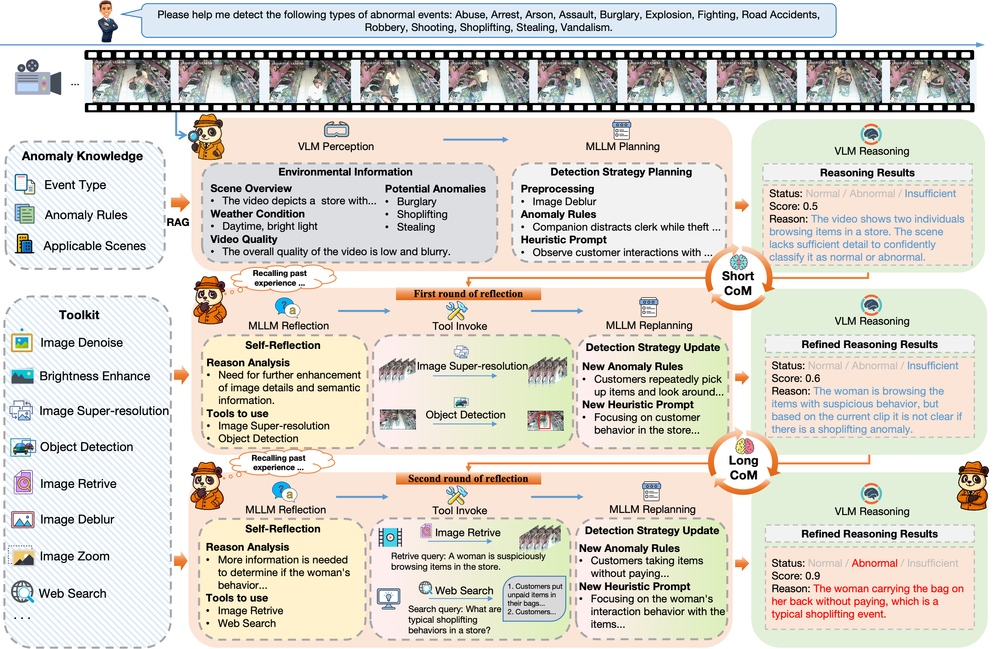

# PANDA: Towards Generalist Video Anomaly Detection via Agentic AI Engineer

<!-- <div align="center">
  
</div> -->
**Zhiwei Yang, Chen Gao, Mike Zheng Shou**  

[**NeurIPS 2025**] Accepted Paper  

---

## 🔍 Overview

Video anomaly detection (VAD) is a critical yet challenging task due to the **complex and diverse nature of real-world scenarios**. Existing approaches usually require **domain-specific training data** and heavy manual tuning, making them costly and less generalizable to unseen anomaly types or environments.  

We present **PANDA**, an **agentic AI engineer** built on MLLMs (multimodal large language models), designed to achieve **generalist video anomaly detection**—handling **any scene and anomaly type automatically, without additional training or human intervention**.  

---

## 🚀 Key Contributions

PANDA introduces **four major capabilities** to realize training-free, generalist VAD:

1. **Self-adaptive scene-aware strategy planning**  
   - A RAG-based mechanism retrieves anomaly-specific knowledge for tailored detection strategies.

2. **Goal-driven heuristic reasoning**  
   - Latent anomaly-guided prompts refine reasoning precision.

3. **Tool-augmented self-reflection**  
   - Progressive reflection with tools (e.g., super-resolution, object detection, retrieval, web search) improves decision-making.

4. **Self-improving chain-of-memory (CoM)**  
   - Leverages past experiences for continual performance enhancement across diverse scenarios.

---

## 🧩 System Framework

<div align="center">
  
</div>

- **Perception**: VLM extracts environmental and video-specific cues.  
- **Planning**: MLLM designs anomaly detection strategies via rules + heuristic prompts.  
- **Reflection**: Iterative tool invocation (e.g., super-resolution, retrieval, web search) enhances analysis.  
- **Chain-of-Memory**: Past reasoning and decisions are recalled to guide future anomaly detection.  

---

## 🔥 Updates
- [09/2025] Repo initialized.  
- ✨ Code release coming soon!   

---

## 📜 Citation

If you find PANDA useful for your research, please consider citing:

```bibtex
@inproceedings{yang2025panda,
  title={PANDA: Towards Generalist Video Anomaly Detection via Agentic AI Engineer},
  author={Yang, Zhiwei and Gao, Chen and Shou, Mike Zheng},
  booktitle={NeurIPS},
  year={2025}
}
```
